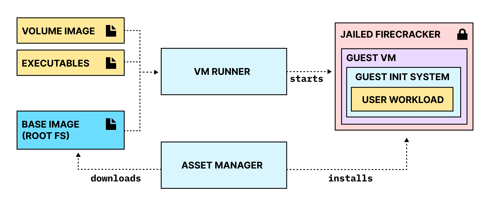
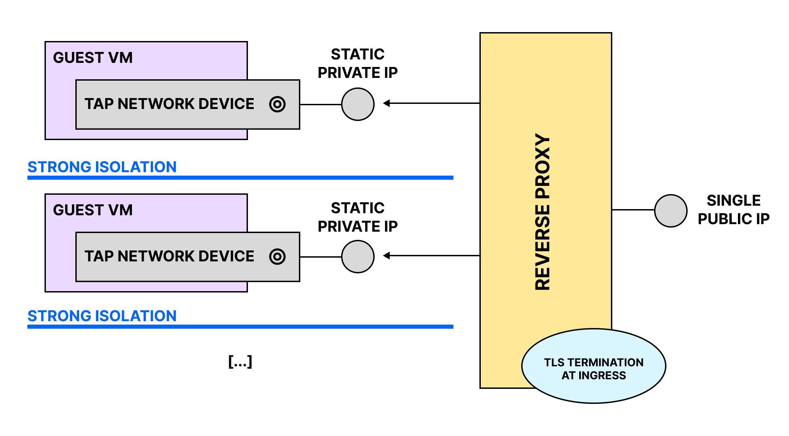

# Architecture

The firegopher project is made up of three main parts:

1. The **VM Runner**, which prepares the host system and starts the guest VM
2. The **Guest Init System**, which runs inside of the guest VM and starts the user workload
3. A set of customised root filesystems ([Base Images](#base-images)) to be used for the guest VM and an **Asset Manager** to install and manage them

## VM Runner
The VM Runner has four main responsibilities:

1. It prepares the root file system for the guest VM
    - by unpacking the user assets into a copy of the chosen [Base Image](#base-images)
    - and creating a configuration file that instructs the [Guest Init System](#guest-init-system) on what to do with them
2. It prepares the [Firecracker Jail](https://github.com/firecracker-microvm/firecracker/blob/main/docs/jailer.md) 
    - by first creating a directory that will later be used by the Firecracker Jailer as a [CHROOT root directory](https://wiki.archlinux.org/title/chroot)
    - and copying/hardlinking all the assets that are needed to run the guest VM into it
3. It creates and configures the network device needed for the guest VM
4. It starts the jailed Firecracker process and supervises it

## Guest Init System
The Guest Init System is a barebones init system specifically designed to run a single application inside of a VM. At its core it is a go-rewrite of [fly-init-snapshot](https://github.com/superfly/init-snapshot).

The main responsibilities of the guest init system are:

1. reading the configuration passed to it from the VM Runner
2. mounting the root file system
3. mounting all the required [device files](https://en.wikipedia.org/wiki/Device_file)
4. configuring the network interface
5. dropping root privileges
6. starting the user workload and supervising it

## Asset Manager
The Asset Manager is currently in the early stages of its development. In its current state it is little more than a glorified download script. 

It downloads the following assets:

1. A Linux Kernel Image
2. A specific version of Firecracker (currently 1.6.0)
3. A modified version of the Ubuntu 22.04 root file system

## Base Images
Currently there is only one officially supported base image available to be used with firegopher. It is a slightly modified version of [Ubuntu 22.04 Minimal](https://cloud-images.ubuntu.com/minimal/releases/jammy/release/). The modifications that are currently done to create the finished base image are:

1. Installing `ca-certificates`, `curl` and `python3`
2. Clearing out the existing package lists afterwards by deleting all files in `/var/lib/apt/lists/`

The current base image creation process is heavily based on the process [outlined by the Firecracker team here](https://github.com/firecracker-microvm/firecracker/blob/main/docs/rootfs-and-kernel-setup.md#creating-a-rootfs-image).

## Networking
The current networking setup is in its very early-stages and should not be considered stable.

Firegopher is designed to be used with a reverse proxy on the host machine that routes incoming traffic to the different running microVMs. In the future Firegopher will automatically configure a reverse proxy based on the users needs. Currently users need to configure a reverse proxy manually.

Currently every microVM is automatically assigned a non-internet-routable IP in the range 172.19.0.0/16. The host system is instructed to forward all traffic from the microVM to the internet.

