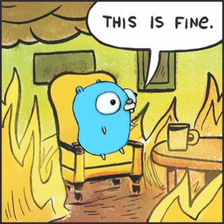

# What is firegopher?
Firegopher is a toolchain for easily running [Firecracker MicroVMs](https://firecracker-microvm.github.io/) on a Linux host. The project currently consists of an installer, a tool to start MicroVMs in a jailed environment and a very basic init system that is used to run simple web applications inside of the MicroVMs.

The project is in its very early stages and has currently very little use outside of teaching its creator a lot about operating systems, golang and how Firecracker works. This being said, it might also be an interesting starting point for others looking into integrating Firecracker. 

> **This project is not meant to be used in production environments.**
>
> You can read more about this under [Known Limitations](/2-user-guide/).

